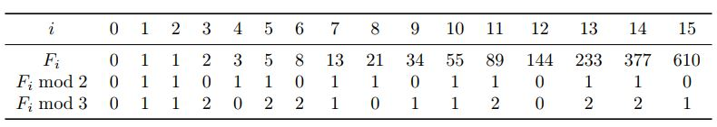

# python-fibonacci_pisano

In this problem, goal is to compute 𝐹𝑛 modulo 𝑚, where 𝑛 may be really huge: up to 10^14. For such
values of 𝑛, an algorithm looping for 𝑛 iterations will not fit into one second for sure. Therefore need to
avoid such a loop.
To get an idea how to solve this problem without going through all 𝐹𝑖 for 𝑖 from 0 to 𝑛, this is what
happens when 𝑚 is small — say, 𝑚 = 2 or 𝑚 = 3.

Both these sequences are periodic. For 𝑚 = 2, the period
is 011 and has length 3, while for 𝑚 = 3 the period is 01120221 and has length 8. Therefore, to compute,
say, 𝐹2015 mod 3 we just need to find the remainder of 2015 when divided by 8. Since 2015 = 251 · 8 + 7, we
conclude that 𝐹2015 mod 3 = 𝐹7 mod 3 = 1.

This is true in general: for any integer 𝑚 ≥ 2, the sequence 𝐹𝑛 mod 𝑚 is periodic. The period always
starts with 01 and is known as **_Pisano period._**

**Task**

Given two integers 𝑛 and 𝑚, output 𝐹𝑛 mod 𝑚 (that is, the remainder of 𝐹𝑛 when divided by 𝑚).

**Input Format**

The input consists of two integers 𝑛 and 𝑚 given on the same line (separated by a space).

**Constraints**

1 ≤ 𝑛 ≤ 1014, 2 ≤ 𝑚 ≤ 103.

**Output Format**

Output 𝐹𝑛 mod 𝑚
